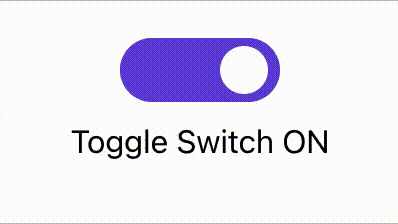
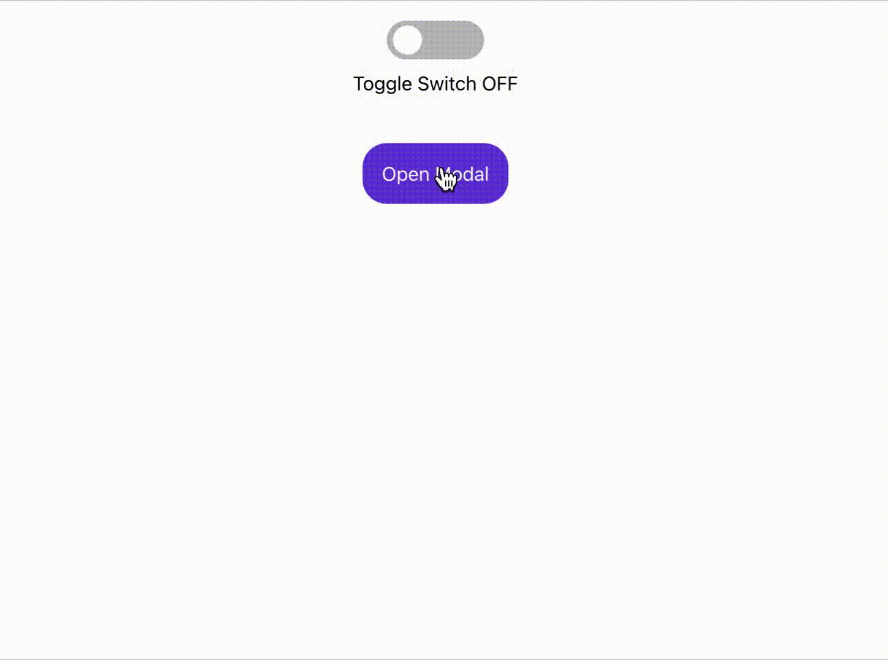
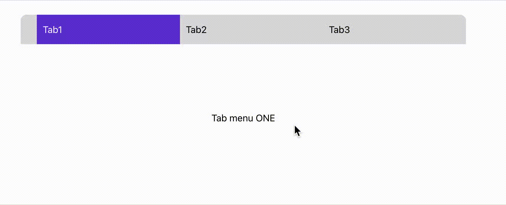

# 원티드 프리 온보딩 '수강생 선발 과제' 연습

---

https://codestates.notion.site/5f83f7a007664f1abcf0cdbcbbbbd521 사이트의 컴포넌트 직접 구현

- 아래에 여섯 가지의 프론트엔드에서 자주 사용하는 컴포넌트 구현하기
  - Toggle.js
  - Modal.js
  - Tab.js
  - Tag.js
  - AutoComplete.js
  - ClickToEdit.js

---

## Toggle Component

</img>

처음엔 아래 코드와 같이 'justify-content' : flex-start, 'background-color' : gray 세팅
이후 'toggle' 상태 변화를 통해 flex-end, 보라색으로 변화 시켰지만 애니메이션 형태로 움직이지 않았습니다.

```
justify-content: flex-start;
background-color: #bbb;

${({ toggle }) =>
    toggle &&
    css`
      justify-content: flex-end;
      background-color: #6741d9;
    `}
```

따라서, animation 설정을 통해 구현해보려했지만 'toggle' 상태에 따라 변화시키는 것이 아닌 자동으로 반복하는 애니메이션만 가능했습니다.

따라서 아래와 같이 transition을 기본 css에 적용하고, 'toggle' 상태 변화에 따라 width 수치 변경하여 최종 구현했습니다.

```
transition: all 0.3s;                   /* progress bar */
transition: transform 0.3s ease-in-out; /* toggle 버튼 */
```

---

## Modal Component

</img>

뒷배경을 아래와 같이 구현하고 Dialog 메시지 박스를 children으로 쉽게 구현 가능했습니다.

다만, 여러 div 요소들에 반복적인 css 요소가 있어서 global style로 지정하여 빠르게 레이아웃을 만들 수 있지 않을까하는 생각이 들었습니다.

```
position: fixed;
background-color: rgba(0, 0, 0, 0.8);
idth: 100%;
height: 100%;
top: 0;
left: 0;
```

---

## Tab Component

</img>

단순 구현은 쉬울 것 같아 Tab 개수 설정에 따라 맞춤 컴포넌트가 될 수 있도록 구현 진행했습니다.

이 프로젝트에서는 예제 내용을 컴포넌트 내부 const 변수로 선언했지만, 실무에서는 redux 등의 전역 상태 관리 라이브러리 또는 props를 통해 받는다는 생각도 같이 하면서 구현했습니다.

또한 아래와 같이 selected 프로퍼티를 꼭 넣어야만 컴포넌트가 작동하는 것이 아닌 useState를 통해 컴포넌트 내부에서 선택된 Tab 내용을 따로 관리해주었습니다.

```
const tabContents = [
{ id: 1, content: "ONE", selected : true },
{ id: 2, content: "TWO", selected : false },
{ id: 3, content: "THREE", selected : false },
];
```

추가로, Tab 개수에 따른 width 변경은 아래와 같이 구현을 해도 실제 적용이 된다는 점을 확인할 수 있었습니다.

```
width: ${(props) => 100 / props.count}%;
```

---

## Tag Component

</img>

관리해야 할 state들이 많아서 Reducer를 활용해도 좋았을 것 같다는 생각이 들었던 컴포넌트입니다.

Tag들과 input이 나열되는 것은 'display : flex; flex-wrap: wrap;'를 활용하여 구현하였고,

onFocus, onBlur 이벤트를 통해 input 포커스 시에 테두리 강조를 구현했습니다.

다만, 구현할 때의 어려웠던 점은 enter 이벤트에 따른 tag 추가였는데, onKeyUp, onKeyPress, onKeyDown 이벤트 중

onKeyPress는 Mozilla Web Docs에 따르면 deprecated로 권고된 이벤트이고,

그 외에 onKeyUp과 onKeyDown의 경우는 한글을 입력할 시에 엔터가 두번 입력이 되는 이슈가 있었습니다.

이는 한글 입력 시에 IME를 통해 입력이 되기 때문에 글자가 완성될때까지 컴포징이라는 단계를 거치게 됩니다.

이때 컴포징이 진행중인 상황에서 enter를 입력하면 컴포징이 해제되면서 enter 이벤트가 한번 더 일어나 총 두번 엔터가 입력되게 됩니다.

KeyboardEvent.isComposing 값을 통해 컴포징 여부를 확인할 수 있고,

```
* onKeyDown 시
isComposing : true, event : enter
isComposing : false, event : enter

* onKeyUp 시
isComposing : false, event : enter
isComposing : false, event : enter
```

onKeyDown 이벤트의 isComposing을 통해 enter를 한번만 일어나게 할 수 있고, 영문일때(isComposing = false)도 고려해야 하므로

isComposing이 true인 enter 이벤트는 무시하도록 개발했습니다.

하지만 side effect가 있는지 확인이 필요한 부분입니다.

---

## AutoComplete Component

</img>

AutoComplete 컴포넌트에서 주요 구현 요소는 input value 값에 대해

Array.prototype.filter(), String.prototype.includes() 메서드를 활용하여 이전 검색어들을 추천했습니다.

이 때 아래와 같이 onChange, onClick 이벤트시에 비슷한 코드이므로 하나의 함수로 리팩토링하는 게 옳은 구현 방법인지 고민을 했습니다.

```
* onChange 시

const inputValue = e.target.value;
setInputs(inputValue);

if (inputValue.length > 0)
  setlists(history.filter((h) => h.content.includes(inputValue)));
else setlists([]);


* onClick 시

setInputs(content);
setlists(history.filter((h) => h.content.includes(content)));

```

---

## ClickToEdit Component

</img>

ClickToEdit 컴포넌트는 간단한 입력 컴포넌트 정도의 난이도였기 때문에 쉽게 구현할 수 있었고,

아래 코드와 같이 input name 별로 value 값을 저장할 수 있도록 'computed property names'을 활용했습니다.

```
const onChange = (e) => {
    setInputs((prevInputs) => ({
      ...prevInputs,
      [e.target.name]: e.target.value
    }));
  };
```

또한 변경 가능한 input value 기본값을 설정하기 위해 'defaultValue'라는 프로퍼티를 활용했습니다.

---

This project was bootstrapped with [Create React App](https://github.com/facebook/create-react-app).

## Available Scripts

In the project directory, you can run:

### `npm start`

Runs the app in the development mode.\
Open [http://localhost:3000](http://localhost:3000) to view it in your browser.

The page will reload when you make changes.\
You may also see any lint errors in the console.
